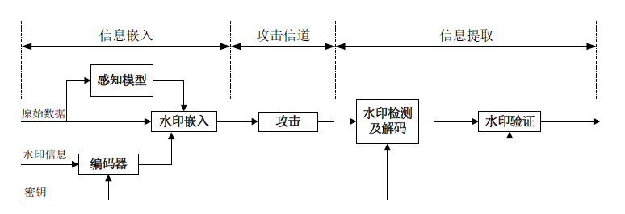
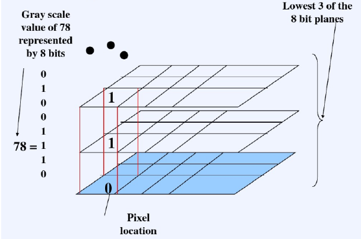
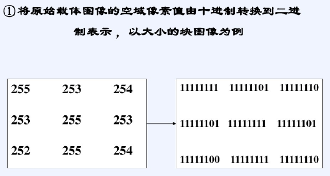
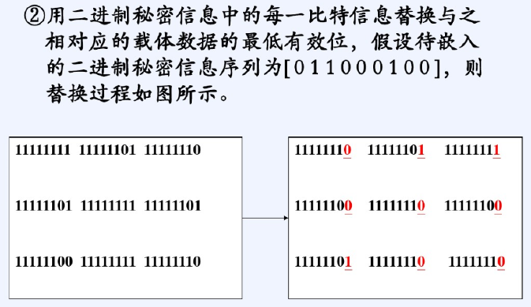
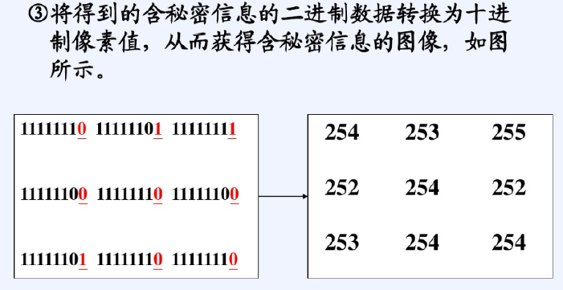
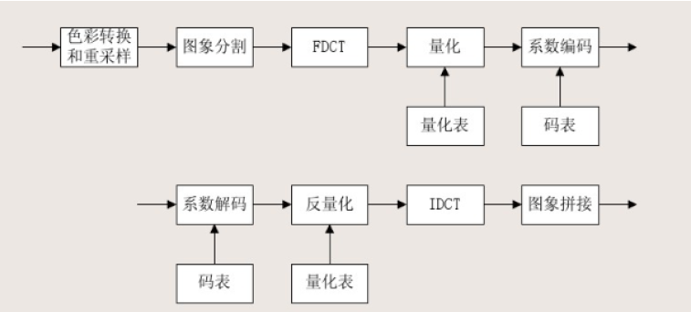
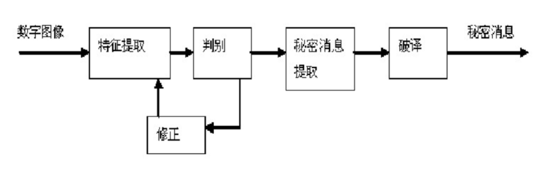

介绍信息隐藏与隐写分析。

<!--more-->

## 信息隐藏

信息隐藏可以分为

- 空域，如LSB。
- 变换域，如DCT。

## 数字水印的嵌入

- 加法嵌入
- 乘法嵌入

图像质量可以用峰值信噪比PSNR评价

## 信息隐藏算法

空域算法，通过直接修改像素值实现隐藏信息嵌入。

- 简单、快速、容量大。
- 鲁棒性差。

灰度256的图像有8个位平面。

## 频域水印算法

在频域，通过修改频域空间的系数实现水印嵌入。

- 鲁棒性好
- 复杂度高

JPEG只改中频系数，不会被消除掉。

- 修改低频部分，容易看出变化，隐蔽性差。
- 修改高频部分，容易被图像压缩算法破坏，鲁棒性差。

## 隐写分析

