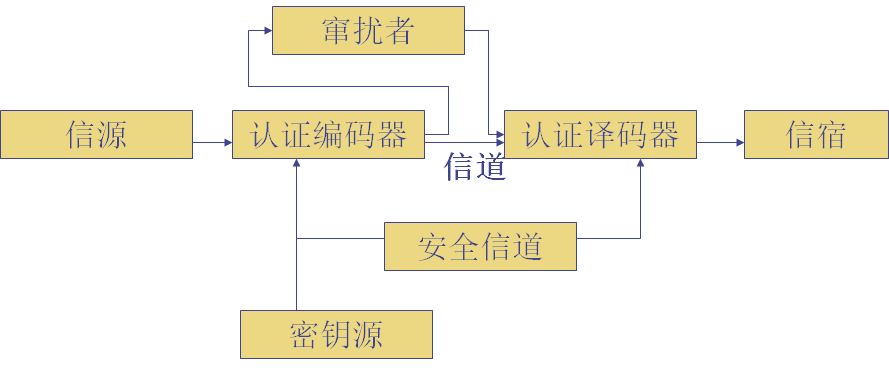
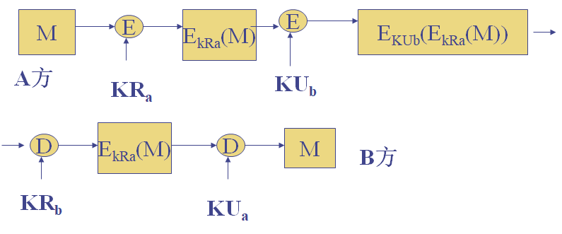
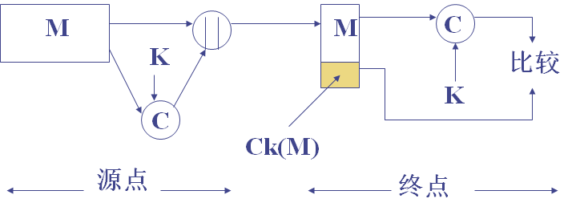
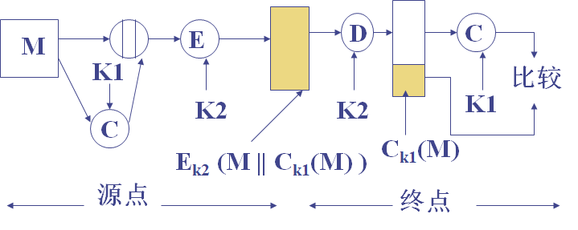
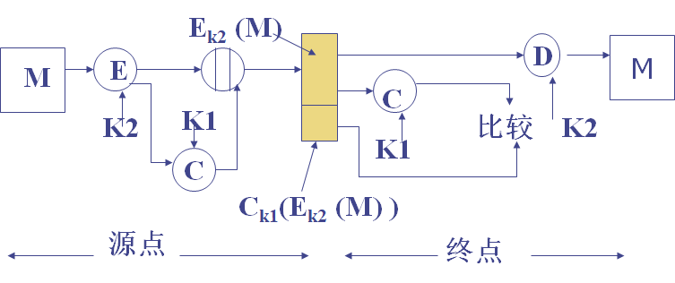
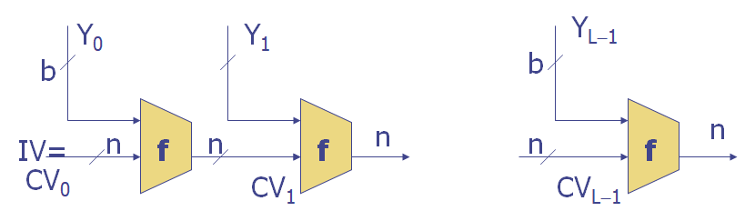
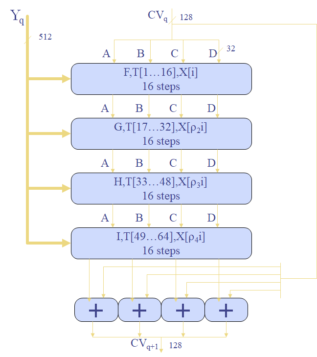
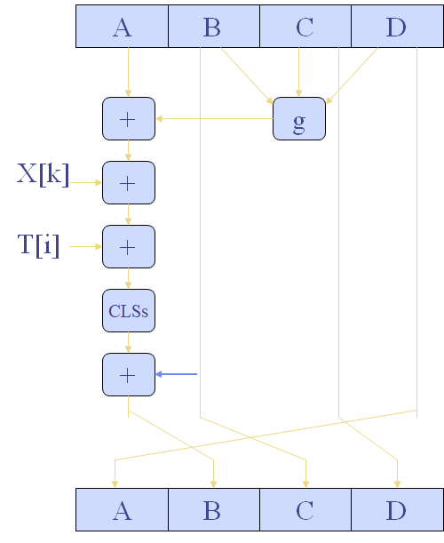
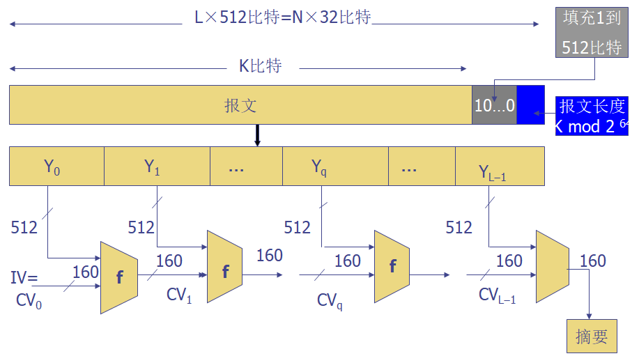
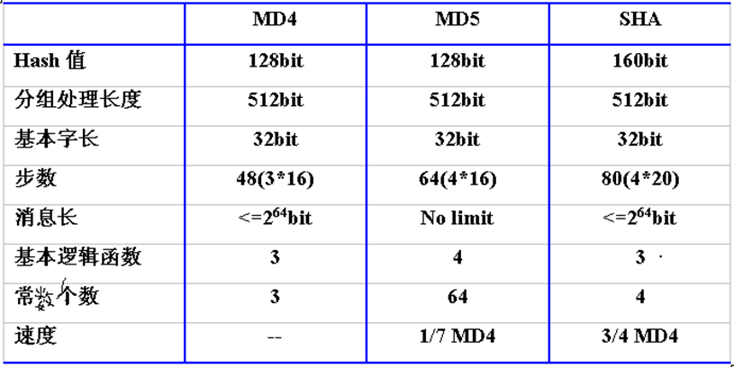

介绍认证方法与哈希函数。

<!--more-->

## 认证

认证是为了防止主动攻击。

- 实体认证（确认发送者的身份）
- 消息认证（验证消息的完整性）

保密和认证是两个概念，纯认证的系统模型如下。

有三种方式产生认证符

- 消息加密
- 消息认证码MAC
  - 需要密钥
- 哈希函数

基于公钥体制，可以实现加密与认证。

## 消息认证码 MAC

MAC对给定消息，使用一个密钥，产生一个短小的定长数据分组。

可以提供认证，因为只有通信双方共享密钥。

也可以实现认证与保密。

消息认证相较于常规加密

- 适用于消息广播
- 认证的代价低
- 某些应用只关心消息的真实性
- 认证与保密的分离能提供结构上的灵活性
- 认证码可以延长消息的保护期限，同时能处理消息内容

认证函数应抗选择明文攻击，且生成同样的认证码在计算上不可行。

可以基于DES实现MAC

- 将消息分为连续的64bit分组

$$
\begin{align}
C_1 &= E_K(M_1) \\
C_2 &= E_K(M_2\oplus C_1) \\
&\dots \\
C_n &= E_K(M_n\oplus C_{n-1})
\end{align}
$$

## 哈希函数

哈希函数将任意长度的消息映射为较短的定长消息。

- $E_K(M||H(M))$$
  - 提供保密与鉴别
- $M||E_K(H(M))$$
  - 提供鉴别
- $M||E_{K_{R_a}}(H(M))$$
  - 提供鉴别与数字签名

简单的哈希函数，对每个分组按bit异或（奇偶校验）。
$$
C_i = b_{i1}\oplus b_{i2}\oplus\cdots\oplus b_{im}
$$

### Merkle-Damgard结构

$$
CV_i = f(CV_{i-1}, Y_{i-1}) \\
H(M) = CV_L
$$

## MD5

符合Merkle-Damgard结构，输入分组长度512bit，输出128bit。

- 添加填充位，满足$length\equiv448\bmod512$。
- 添加长度，用64bit表示，若超过只取低64位。
- 使用一个128bit缓存存放结果，表示为$(A,B,C,D)$。
- 处理512bit的报文分组，核心是包含4个循环的压缩函数f，每个循环包括16步。
- 所有L个51bit的分组处理后，第L个阶段的输出作为128bit摘要输出。

MD4有3轮，每轮16步。

MD5每轮加上前一步的结果，有雪崩效应。

## SHA-1

输入最大长度为$2^{64}$，输出160bit，分组大小512bit。

SHA-1的函数有四轮，每轮20步。

## 安全性分析

- SHA = MD4 + 扩展变换 + 外加一轮 + 更好的雪崩
- MD5 = MD4 + 改进的比特杂凑 + 外加一轮 + 更好的雪崩

哈希函数可以受到野蛮攻击和生日攻击

k个人中，至少存在两人生日相同的概率为
$$
P(365, k) = 1 - \frac {365!} {(365-k)365^k}
$$
