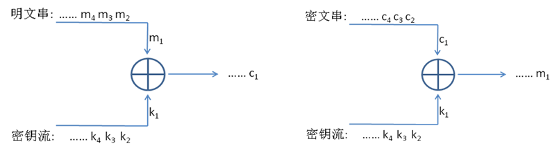
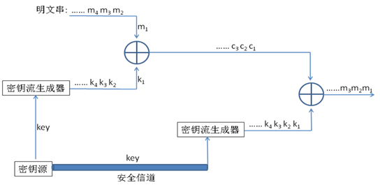
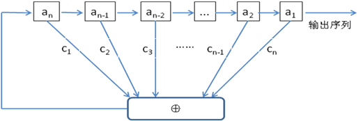
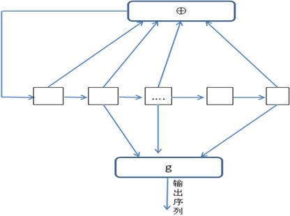
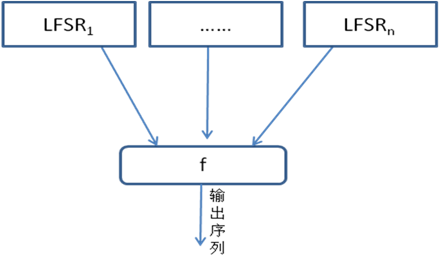
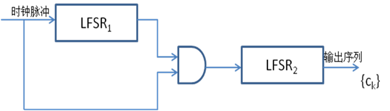

介绍序列密码（流密码）。

<!--more-->

## 流密码

流密码的简单结构如下。

对于流密码来说，需要生成一个作为密钥流的“随机”比特序列。

流密码的安全性取决于密钥的安全等级。

流密码可以分为两种

- 同步流密码
  - 密钥流的产生与明文消息相互独立
- 自同步流密码
  - 密钥流的产生与之间产生的若干密文有关

## 线性反馈移位寄存器 LFSR

LFSR可以产生同步密钥流。
$$
a_i(t+1) = a_{i+1}(t),\ i=1,2,\dots,n-1 \\
a_n(t+1) = c_na_1(t) \oplus c_{n-1}a_2(t) \oplus\dots\oplus c_1a_n(t)
$$
联结多项式为
$$
c_nx^n + c_{n-1}x^{n-1} +\dots+ c_1x+1
$$

例如对于联接多项式$x^3+x^2+1$，对应的反馈函数为
$$
a_3 = a_1 \oplus a_2
$$
对于LFSR来说，一个n级LFSR序列的周期最大为$2^n-1$。

如果产生了最大周期，则称为m序列，LFSR的状态转移图只有两个圈。

## 伪随机序列

### Golomb随机性假设

- 在每一周期内，0和1的个数近似相等。
- 在每一周期内，长度为i的游程占游程总数的$\frac{1}{2^i}$。
- 定义自相关函数$C(\tau)=\sum_{i=1}^n(-1)^{a_i+a_{i+\tau}}$。
  - 那么$C(\tau)=\begin{cases}n,\quad\tau\equiv0\mod n\\c,\quad others\end{cases}$$

### m序列的伪随机性

### 线性复杂度

能够输出该序列的最短LFSR的级数。

一个好的流密码，应该具有大周期、大的线性复杂度，同时满足Golomb随机性假设。

## 基于LFSR的伪随机序列生成器

### 滤波生成器

### 组合生成器

### 钟控生成器

