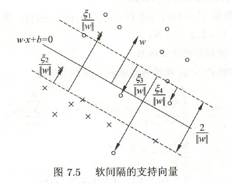
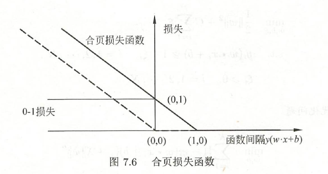
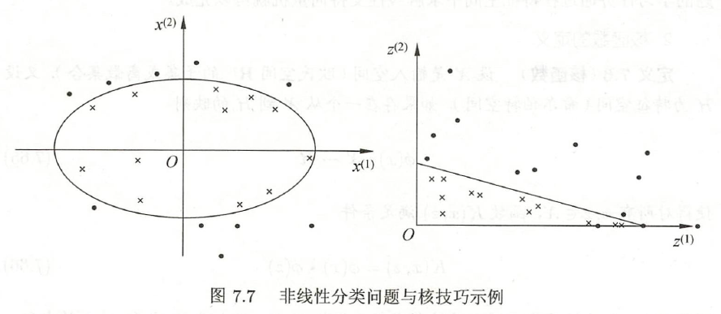

SVM是一种二分类模型，其基本模型是定义在特征空间上的间隔最大的线性分类器，间隔最大使其区别于感知机。

SVM包括Kernel trick，使其成为实质上的非线性分类器，SVM的学习策略是间隔最大化，学习算法是求解凸二次规划的最优化算法。

SVM包括三种模型：线性可分SVM、线性SVM、非线性SVM。

<!--more-->

## 7.1 线性可分SVM与硬间隔最大化

### 线性可分SVM

对于二分类问题，线性可分SVM假设输入空间与特征空间的元素一一对应。

给定训练集
$$
T = \{(x_1,y_1),(x_2,y_2),\cdots,(x_N,y_N)\} \\
x_i\in{\cal X} = \mathbb{R}^n,\quad y_i\in{\cal Y}=\{-1,+1\}
$$
假设训练数据集是**线性可分**的（见2.2）

通过间隔最大化或等价地求解相应的凸二次规划问题学习得到的分离超平面为
$$
w^*\cdot x+b^*=0
$$
相应的分类决策函数
$$
f(x) = sign(w^*\cdot x+b^*)
$$
称为线性可分SVM。

### 函数间隔和几何间隔

对于给定的训练集T和超平面$(w,b)$，定义超平面关于样本点的函数间隔为
$$
\hat\gamma_i = y_i(w\cdot x_i+b)
$$
定义超平面关于训练集T的函数间隔为
$$
\hat\gamma = \min_{i=1,\cdots,N}\hat\gamma_i
$$
函数间隔可以表示分类预测的正确性及确信度，但成比例地改变参数时，超平面没有改变，函数间隔却成比例地改变，因此需要定义几何间隔。

某一实例点与超平面的距离为
$$
\gamma_i=\frac w {\|w\|}\cdot x_i+\frac b {\|w\|}
$$
其中$\|w\|$为$L_2$范数，如果实例点在超平面负的一侧，取负值即可。

因此定义几何间隔为
$$
\gamma_i=y_i(\frac w {\|w\|}\cdot x_i+\frac b {\|w\|}) \\
\gamma = \min_{i=1,\cdots,N}\gamma_i
$$
函数间隔和几何间隔满足如下关系
$$
\gamma_i=\frac{\hat\gamma_i}{\|w\|},\quad \gamma=\frac{\hat\gamma}{\|w\|}
$$

### 间隔最大化

SVM学习的基本想法是，求解能够划分训练集并且几何间隔最大的分离超平面。

对于线性可分的训练集，线性可分分离超平面有无穷多个，但集合间隔最大的分离超平面是唯一的。

下面考虑如何求解最大间隔分离超平面，表示为下面的约束最优化问题
$$
\begin{align}
\max_{w,b} \quad&\gamma \\
s.t. \quad&y_i(\frac w {\|w\|}\cdot x_i+\frac b {\|w\|})\geq\gamma, \quad i=1,2,\cdots,N
\end{align}
$$
利用几何间隔和函数间隔的关系
$$
\begin{align}
\max_{w,b} \quad&\frac{\hat\gamma}{\|w\|} \\
s.t. \quad&y_i( w\cdot x_i+b)\geq\hat\gamma, \quad i=1,2,\cdots,N
\end{align}
$$
取$\hat\gamma=1$，注意到最大化$\frac 1{\|w\|}$与最小化$\frac 1 2\|w\|^2$是等价的，由此将问题转化为
$$
\begin{align}
\min_{w,b} \quad&\frac 1 2\|w\|^2 \\
s.t. \quad&y_i( w\cdot x_i+b)-1\geq0, \quad i=1,2,\cdots,N
\end{align} \tag{7.1}
$$
这就是一个凸二次规划问题。

#### 凸优化问题

凸优化问题是指约束最优化问题
$$
\begin{align}
\min_w \quad& f(w) \\
s.t. \quad& g_i(w)\leq0, \quad i=1,2,\cdots,k\\
\quad &h_i(w)=0,\quad i=1,2,\cdots,l
\end{align}
$$
其中，$f(w)$和$g_i(w)$都是$\R^n$上连续可微的凸函数，约束函数$h_i(w)$是$\R^n$上的仿射函数。

> $f(x)$称为仿射函数，如果它满足$f(x) = a\cdot x+b$，其中$a,x\in\mathbb{R}^n,b\in\mathbb{R}$$

当$f(w)$是二次函数，且约束函数$g_i(w)$是仿射函数时，凸优化问题称为凸二次规划问题。

可以证明，最大间隔分离超平面是存在且唯一的。

#### 支持向量和间隔边界

在线性可分情况下，训练集中的样本点与分离超平面距离最近的，称为支持向量。

支持向量满足等式
$$
y_i(w\cdot x_i+b)-1=0
$$
定义超平面
$$
H_1: w\cdot x+b=1 \\
H_2: w\cdot x+b=-1
$$
显然，在$H_1$和$H_2$上的点就是支持向量，这两个超平面成为间隔边界。。

注意到这两个超平面平行，并且没有实例点落在其中，由此形成一条长带。

两个超平面之间的距离成为间隔，它依赖于分离超平面的法向量$w$，等于$\frac 2{\|w\|}$。

在决定分离超平面时，只有支持向量起作用。如果在间隔边界以外移动其他实例点，甚至去掉这些点，超平面是不会改变的。

因为支持向量的决定性作用，所以讲这种分类模型称为支持向量机。

支持向量的个数一般很少，所以SVM由很少的“重要的”训练样本确定。

### 学习的对偶算法

利用拉格朗日对偶性，通过求解对偶问题得到原始问题的最优解。这样做的优点，一是对偶问题往往更容易求解；二是自然引入核函数，从而推广到非线性分类问题。

首先构造拉格朗日函数
$$
L(w,b,\alpha) = \frac1 2{\|w\|}^2-\sum_{i=1}^N\alpha_iy_i(w\cdot x_i+b)+\sum_{i=1}^N\alpha_i \\
\alpha = (\alpha_1,\alpha_2,\cdots,\alpha_N)^T
$$
根据对偶性，原始问题的对偶问题是
$$
\max_\alpha\min_{w,b}L(w,b,\alpha)
$$
分别求偏导数并令其等于0。
$$
\nabla_wL(w,b,\alpha) = w-\sum_{i=1}^N\alpha_iy_ix_i = 0\\
\nabla_bL(w,b,\alpha) = -\sum_{i=1}^N\alpha_iy_i = 0
$$
由此得到
$$
w = \sum_{i=1}^N\alpha_iy_ix_i \\
\sum_{i=1}^N\alpha_iy_i=0
$$
将其代入原函数
$$
\begin{align}
L(w,b,\alpha) &= \frac12\sum_{i=1}^N\sum_{j=1}^N\alpha_i\alpha_jy_iy_j(x_i\cdot x_j) - \sum_{i=1}^N\alpha_iy_i((\sum_{j=1}^N\alpha_jy_jx_j)\cdot x_i+b)+\sum_{i=1}^N\alpha_i \\
&= -\frac12\sum_{i=1}^N\sum_{j=1}^N\alpha_i\alpha_jy_iy_j(x_i\cdot x_j)+\sum_{i=1}^N\alpha_i
\end{align}
$$
对其求极大值
$$
\begin{align}
\max_\alpha \quad& -\frac12\sum_{i=1}^N\sum_{j=1}^N\alpha_i\alpha_jy_iy_j(x_i\cdot x_j)+\sum_{i=1}^N\alpha_i \\
s.t. \quad& \sum_{i=1}^N\alpha_iy_i=0\\
\quad &\alpha_i\geq0,\quad i=1,2,\cdots,N
\end{align}
$$
也即
$$
\begin{align}
\min_\alpha \quad& \frac12\sum_{i=1}^N\sum_{j=1}^N\alpha_i\alpha_jy_iy_j(x_i\cdot x_j)-\sum_{i=1}^N\alpha_i \\
s.t. \quad& \sum_{i=1}^N\alpha_iy_i=0\\
\quad &\alpha_i\geq0,\quad i=1,2,\cdots,N
\end{align} \tag{7.2}
$$
原始问题(7.1)转化为求解对偶问题(7.2)

假设$\alpha^*=(\alpha_1^*,\alpha_2^*,\cdots,\alpha_l^*)^T$为对偶最优化问题的解，则原始问题的解可通过如下关系求得
$$
w^*=\sum_{i=1}^N\alpha_i^*y_ix_i \\
b^* = y_j-\sum_{i=1}^N\alpha_i^*y_i(x_i\cdot x_j),\quad\alpha_j^*>0
$$
由此求得分离超平面和分类决策函数
$$
w^*\cdot x+b^*=0 \\
f(x) = sign(w^*\cdot x+b^*)
$$
对于线性可分问题，上述学习算法是完美的，但现实问题中，样本中会出现噪声或特异点，此时需要更一般的学习算法。

## 7.2 线性SVM与软间隔最大化

### 线性SVM

线性可分SVM的学习方法，对于线性不可分训练数据是不适用的，需要修改硬间隔最大化，使其成为软间隔最大化。

通常情况是，训练数据中有一些特异点（outlier），去除这些点后，剩下的样本点组成的集合是线性可分的。

通过引入松弛变量
$$
y_i(w\cdot x_i+b)\geq1-\xi_i,\quad\xi_i\geq0
$$
这样，目标函数变成
$$
\frac12\|w\|^2\rightarrow\frac12\|w\|^2+C\sum_{i=1}^N\xi_i,\quad C>0
$$
这里，C称为惩罚参数，使间隔尽量大，同时误分类点的个数尽量小。

由此，线性SVM的学习问题变成如下凸二次规划问题
$$
\begin{align}
\min_{w,b,\xi} \quad&\frac12\|w\|^2+C\sum_{i=1}^N\xi_i \\
s.t. \quad&y_i( w\cdot x_i+b)\geq1-\xi_i,\quad  i=1,2,\cdots,N\\
\quad&\xi_i\geq0,\quad  i=1,2,\cdots,N
\end{align} \tag{7.3}
$$

### 学习的对偶算法

通过拉格朗日函数，可以推导出(7.3)的对偶问题即为
$$
\begin{align}
\min_\alpha \quad& \frac12\sum_{i=1}^N\sum_{j=1}^N\alpha_i\alpha_jy_iy_j(x_i\cdot x_j)-\sum_{i=1}^N\alpha_i \\
s.t. \quad& \sum_{i=1}^N\alpha_iy_i=0\\
\quad &0\leq\alpha_i\leq C_i,\quad i=1,2,\cdots,N
\end{align} \tag{7.4}
$$

### 支持向量

在线性不可分的情况下，将对偶问题(7.4)的解$\alpha^*=(\alpha_1^*,\alpha^*_2,\cdots \alpha^*_N)^T$中对应于$\alpha^*_i>0$的样本点的实例称为支持向量。

若$\alpha^*_i<C$，则$\xi_i=0$，支持向量恰好落在间隔边界上。

若$\alpha^*_i=C，0<\xi_i<1$，分类正确，支持向量落在间隔边界与分离超平面之间。

若$\alpha^*_i=C，\xi_i=1$，则支持向量在分离超平面上。

若$\alpha^*_i=C，\xi_i>1$，分类错误，支持向量位于分离超平面误分一侧。

### 合页损失函数

线性SVM还有另外一种解释，就是最小化以下目标函数
$$
\sum_{i=1}^N[1-y_i(w\cdot x_i+b)]_++\lambda\|w\|^2
$$
其中第一项是经验损失，使用到了合页损失函数
$$
[z]_+=\begin{cases}z,\quad z>0\\0,\quad z\leq0\end{cases}
$$
当样本点正确分类，并且函数间隔大于1时，损失为0，否则计算损失。

线性SVM原始最优化问题(7.3)等价于最优化问题
$$
\min_{w,b}\quad\sum_{i=1}^N[1-y_i(w\cdot x_i+b)]_++\lambda\|w\|^2\tag{7.5}
$$
事实上，记
$$
\xi_i=[1-y_i(w\cdot x_i+b)]_+
$$
满足原问题约束条件
$$
y_i( w\cdot x_i+b)\geq1-\xi_i,\quad  i=1,2,\cdots,N\\
\xi_i\geq0,\quad  i=1,2,\cdots,N
$$
取$\lambda=\frac1{2C}$，则等价于
$$
\min_{w,b}\quad\frac1C(\frac12\|w\|^2+C\sum_{i=1}^N\xi_i)
$$
即与原问题等价。

## 7.3 非线性SVM与核函数

### Kernel trick

对于一些问题，需要利用非线性模型才能很好地进行分类。

给定训练集T，如果能用$\mathbb{R}^n$中的一个超曲面将正负例正确分开，则成为非线性可分问题。

非线性问题往往不容易求解，所以常采用非线性变换，将其转化为线性问题。

设原空间为${\cal X}\subset\mathbb{R}^2,x=(x^{(1)},x^{(2)})^T\in\cal X$，新空间为${\cal Z}\subset\mathbb{R}^2,z=(z^{(1)},z^{(2)})^T\in\cal Z$，定义映射
$$
z=\phi(x)=((x^{(1)})^2,(x^{(2)})^2)^T
$$
经过变换$z=\phi(x)$，原空间变为新空间，原空间中的椭圆变换成为新空间中的直线
$$
w_1(x^{(1)})^2+w_2(x^{(2)})^2+b=0 \\
\rightarrow w_1z^{(1)}+w_2z^{(2)}+b=0
$$

#### 核函数

设$\cal X$是输入空间，$\cal H$为特征空间，如果存在映射
$$
\phi(x): \cal X\rightarrow H
$$
使得
$$
\forall x,z\in{\cal X},\quad K(x,z)=\phi(x)\phi(z)
$$
则称$K(x,z)$为核函数，$\phi(x)$为映射函数。

Kernel trick的想法是，在学习与预测中只定义$K(x,z)$，而不显式定义映射函数。

通常，直接计算$K(x,z)$比较容易，而通过映射函数计算$K(x,z)$并不容易。

#### 应用

注意到，在线性SVM的对偶问题(7.4)中，目标函数和决策函数都只设计输入实例与实力之间的内积，可以用核函数来代替，此时对偶问题的目标函数成为
$$
W(\alpha)=\frac12\sum_{i=1}^N\sum_{j=1}^N\alpha_i\alpha_jy_iy_jK(x_i,x_j)-\sum_{i=1}^N\alpha_i
$$
分类决策函数成为
$$
\begin{align}
f(x) &= sign(\sum_{i=1}^N\alpha^*_iy_i\phi(x_i)\cdot\phi(x)+b^*)\\
&= sign(\sum_{i=1}^N\alpha^*_iy_iK(x_i,x)+b^*)
\end{align}
$$

### 正定核

设$K:{\cal X}\times{\cal X}\rightarrow\mathbb{R}$是对称函数，则$K(x,z)$为正定核函数的充要条件是$\forall x_i\in{\cal X},i=1,2,\cdots,m$，$K(x,z)$对应的Gram矩阵：
$$
K=[K(x_i,x_j)]_{m\times m}
$$
是半正定矩阵。

### 常见核函数

#### 多项式核函数

$$
K(x,z) = (x\cdot z+1)^p
$$

对应的SVM是一个p次多项式分类器，此时分类决策函数为
$$
f(x) = sign(\sum_{i=1}^N\alpha_i^*y_i(x_i\cdot x+1)^p+b^*)
$$

#### 高斯核函数

#### 字符串核函数

### 非线性SVM

给定非线性分类训练集，通过核函数与软间隔最大化，或凸二次优化，学习得到的分类决策函数
$$
f(x) = sign(\sum_{i=1}^N\alpha^*_iy_iK(x_i,x)+b^*)
$$
称为非线性SVM，其中$K(x,z)$是正定核函数。

## 7.4 序列最小最优化算法

已知SVM的学习问题可以形式化为求解凸二次规划问题，这样的凸二次规划问题具有全局最优解，但是当训练样本容量很大时，常见的最优化算法变得非常低效。

序列最小最优化（SMO）算法，就是高效实现SVM学习的一种算法。

SMO算法求解如下问题：
$$
\begin{align}
\min_\alpha \quad& \frac12\sum_{i=1}^N\sum_{j=1}^N\alpha_i\alpha_jy_iy_jK(x_i,x_j)-\sum_{i=1}^N\alpha_i \\
s.t. \quad& \sum_{i=1}^N\alpha_iy_i=0\\
\quad &0\leq\alpha_i\leq C_i,\quad i=1,2,\cdots,N
\end{align} \tag{7.4}
$$
TO BE COMPLETED