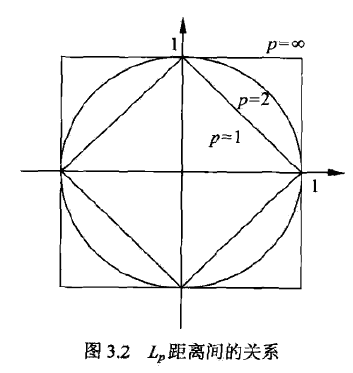
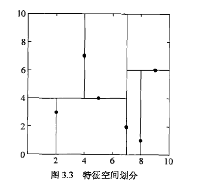
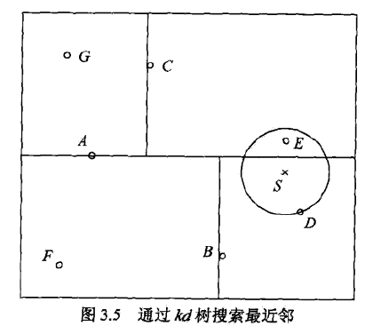

k近邻法，是一种基本分类与回归方法。输入为特征向量，输出为类别。

<!--more-->

## 3.1 k近邻算法

给定一个训练集，对新的输入实例，在训练集中找到最邻近的k个实例，将输入实例分为多数类。

- 输入：训练数据集T，实例特征向量x。
- 输出：实例x所属的类y。
- 根据给定的距离度量，在T中找出与x最邻近的k个点。
- 在邻域中根据分类决策规则（如多数表决）决定x的类别y。
- k=1时，称为最近邻算法，将与x最邻近点的类作为x的类。

## 3.2 k近邻模型

### 距离度量

$$L_p$$距离定义为
$$
L_p(x_i, x_j) = (\sum _{l=1} ^n |x_i^{(l)}-x_j^{(l)}|^p)^{\frac 1 p}
$$
p=1时，称为曼哈顿距离
$$
L_1(x_i, x_j) = (\sum _{l=1} ^n |x_i^{(l)}-x_j^{(l)}|)
$$
p=2时，即为欧式距离
$$
L_2(x_i, x_j) = (\sum _{l=1} ^n |x_i^{(l)}-x_j^{(l)}|^2)^{\frac 1 2}
$$
p=∞时，称为切比雪夫距离，为各个坐标距离的最大值
$$
L_\infty(x_i, x_j) = \max_l |x_i^{(l)}-x_j^{(l)}|
$$
下图给出了与原点距离为1的图形



### 分类决策规则

k近邻法中的分类决策规则往往是多数表决，即由k个临近点的多数类决定输入类。

如果分类的损失函数为0-1损失函数，分类函数为
$$
f: \mathbf R^n \rightarrow \{c_1, c_2, ..., c_K\}
$$
那么误分类的概率为
$$
P(Y\neq f(X)) = 1- P(Y=f(X)) \\
\Leftrightarrow \frac 1 k \sum _{x_i\in N_k(x)} I(y_i\neq c_j) = 1 - \frac 1 k \sum _{x_i\in N_k(x)} I(y_i= c_j)
$$
## 3.3 k近邻法的实现：kd树

### 构造kd树

kd树是二叉树，表示对k维空间的一个划分。

构造kd树相当于不断地用超平面切分k维空间，构成一系列的k维超矩形区域，kd树的每个节点对应于一个k维超矩形区域。

构造算法如下

1. 开始：构造根节点，对应于包含T的k维空间的超矩形区域。
   - 选择$$x^{(1)}$$为坐标轴，以T中所有实例的$$x^{(1)}$$坐标的中位数为切分点，将根节点对应的超矩形区域切分为两个子区域。
   - 由此生成深度为一的左右子节点，左子节点对应于坐标$$x^{(1)}$$小于切分点的子区域。
2. 重复：对深度为j的节点，选择$$x^{(l)}$$为切分的坐标轴，其中$$l=j(mod k)+1$$，以坐标的中位数为切分点。
   - 由此生成深度为j+1的左右子节点，左子节点对应于坐标$$x^{(l)}$$小于切分点的子区域。
3. 直到两个子区域没有实例存在时停止，形成kd树的区域划分。



### 搜索kd树

给定一个目标点，搜索其最近邻，首先找到包含目标点的叶节点。从叶节点出发，依次回退到父节点，不断查找与目标点最邻近的节点。

给定如图所示的kd树，根节点为A，子节点为B、C等，输入实例点为S，求S的最近邻。

- 首先找到包含S的叶结点D，以D作为近似最近邻。
- 返回D的父节点B，在B的另一子节点F的区域内搜索。
- 继续返回上一级父节点A，在A的另一子节点C的区域内搜索。
- 点E比点D更近，成为最近邻。



## Scikit-learn

```python
from sklearn.neighbors import KNeighborsClassifier

clf_sk = KNeighborsClassifier()
clf_sk.fit(X_train, y_train)

clf_sk.score(X_test, y_test)
```

