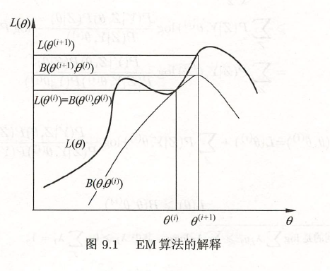

EM算法是一种迭代算法，用于含隐变量的概率模型参数的极大似然估计，或极大后验概率估计。

<!--more-->

## 9.1 EM算法的引入

### 三硬币模型

假设有三枚硬币，记作A、B、C，这些硬币正面出现的概率分别为π、p、q。进行如下实验：先掷硬币A，根据结果选择硬币，正面选B，反面选C；然后掷选出的硬币，正面记作1，反面记作0；独立重复n次，得到观测结果。

假设只能观测到掷硬币的结果，不能观测过程，问如何估计三硬币正面出现的概率。
$$
\begin{align}
P(y|\theta)=\sum_zP(y,z|\theta)&=\sum_zP(z|\theta)P(y|z,\theta) \\
&= \pi p^y(1-p)^{1-y}+(1-\pi)q^y(1-q)^{1-y}
\end{align}
$$
其中，y表示观测变量，z为隐变量，表示硬币A的结果，θ为模型参数。

将观测数据表示为$$Y=(Y_1,Y_2,\cdots Y_n)^T$$，未观测数据表示为$$Z=(Z_1,Z_2,\cdots Z_n)^T$$，则似然函数为
$$
\begin{align}
P(Y|\theta)&=\sum_ZP(Z|\theta)P(Y|Z,\theta) \\
&= \prod_{j=1}^n[\pi p^{y_i}(1-p)^{1-y_i}+(1-\pi)q^{y_i}(1-q)^{1-y_i}]
\end{align}
$$
考虑$$\theta=(\pi,p,q)$$的极大似然估计
$$
\hat\theta=\arg\max_\theta\log P(Y|\theta)
$$

这个问题没有解析解，只能通过迭代求解，EM算法就是这样一种迭代算法。

### EM算法

输入：观测变量数据Y，隐变量数据Z，联合分布$$P(Y,Z|\theta)$$，条件分布$$P(Z|Y,\theta)$$；

输出：模型参数$$\theta$$。

- 选择参数的初值$$\theta^{(0)}$$，开始迭代；

- E步：记$$\theta^{(i)}$$表示第i次迭代时参数的估计值，在第i+1次迭代，计算
  $$
  \begin{align}
  Q(\theta,\theta^{(i)})&=E_Z[\log P(Y,Z|\theta)|Y,\theta^{(i)}]\\
  &=\sum_Z\log P(Y,Z|\theta)P(Z|Y,\theta^{(i)})
  \end{align}
  $$
  
- M步：求使得$$Q(\theta,\theta^{(i)})$$极大化的参数值，确定第i+1次迭代的参数值
  $$
  \theta^{(i+1)}=\arg\max_\theta Q(\theta,\theta^{(i)})
  $$

- 重复上述步骤，直到收敛。

参数的初值可以任意选择，但EM算法对初值是敏感的。

停止迭代的条件一般是
$$
\|\theta^{(i+1)}-\theta^{(i)}\|<\epsilon_1 \quad or \quad \|Q(\theta^{(i+1)},\theta^{(i)})-Q(\theta^{(i)},\theta^{(i)})\|<\epsilon_2
$$
### EM算法的导出

面对一个含有隐变量的概率模型，我们希望极大化观测数据关于参数的对数似然函数，即
$$
\begin{align}
L(\theta)&=\log P(Y|\theta)=\log\sum_ZP(Y,Z|\theta) \\
&= \log(\sum_ZP(Z|\theta)P(Y|Z,\theta))
\end{align}
$$
EM算法通过迭代，逐步近似最大化函数，考虑
$$
L(\theta)-L(\theta^{(i)})=\log(\sum_ZP(Z|\theta)P(Y|Z,\theta))-\log P(Y|\theta^{(i)})
$$
利用Jensen不等式
$$
\begin{align}
L(\theta)-L(\theta^{(i)})&=\log(\sum_ZP(Z|Y,\theta^{(i)})\frac{P(Z|\theta)P(Y|Z,\theta)}{P(Z|Y,\theta^{(i)})})-\log P(Y|\theta^{(i)})\\
&\geq\sum_ZP(Z|Y,\theta^{(i)})\log\frac{P(Z|\theta)P(Y|Z,\theta)}{P(Z|Y,\theta^{(i)})}-\log P(Y|\theta^{(i)})\\
&=\sum_ZP(Z|Y,\theta^{(i)})\log\frac{P(Z|\theta)P(Y|Z,\theta)}{P(Z|Y,\theta^{(i)})P(Y|\theta^{(i)})}
\end{align}
$$

> $$\log\sum_j\lambda_jy_j\geq\sum_j\lambda_j\log y_j,\quad\lambda_j\geq0,\quad\sum_j\lambda_j=1$$

记
$$
B(\theta,\theta^{(i)})\hat=L(\theta^{(i)})+\sum_ZP(Z|Y,\theta^{(i)})\log\frac{P(Z|\theta)P(Y|Z,\theta)}{P(Z|Y,\theta^{(i)})P(Y|\theta^{(i)})}
$$
则有
$$
L(\theta)\geq B(\theta,\theta^{(i)})
$$
即$$B(\theta,\theta^{(i)})$$是$$L(\theta)$$的一个下界，为了使$$L(\theta)$$尽可能大地增长，选择
$$
\theta^{(i+1)}=\arg\max_\theta B(\theta,\theta^{(i)})
$$
省去常数项，得到
$$
\begin{align}
\theta^{(i+1)}&=\arg\max_\theta(L(\theta^{(i)})+\sum_ZP(Z|Y,\theta^{(i)})\log\frac{P(Z|\theta)P(Y|Z,\theta)}{P(Z|Y,\theta^{(i)})P(Y|\theta^{(i)})})\\
&=\arg\max_\theta(\sum_ZP(Z|Y,\theta^{(i)})\log P(Z|\theta)P(Y|Z,\theta))\\
&=\arg\max_\theta(\sum_ZP(Z|Y,\theta^{(i)})\log P(Y,Z|\theta))\\
&=\arg\max_\theta Q(\theta,\theta^{(i)})
\end{align}
$$


## 9.2 EM算法的收敛性

**定理 9.1**	设$$P(Y|\theta)$$为观测数据的似然函数，则$$P(Y|\theta^{(i)})$$是单调递增的。

**定理 9.2**	设$$L(\theta)=\log P(Y|\theta)$$为观测数据的对数似然函数，则有

- 如果$$P(Y|\theta)$$有上界，则$$L(\theta^{(i)}=\log P(Y|\theta^{(i)})$$收敛到某一值。
- 在$$Q(\theta,\theta')$$与$$L(\theta)$$满足一定条件下，由EM算法得到的参数估计序列的收敛值是$$L(\theta)$$的稳定点。

## 9.3 EM算法在高斯混合模型学习中的应用

### 高斯混合模型

高斯混合模型是指具有如下形式的概率分布模型
$$
P(y|\theta)=\sum_{k=1}^K\alpha_k\phi(y|\theta_k),\quad\alpha_k\geq0,\quad\sum_{k=1}\alpha_k=1
$$
其中$$\phi(y|\theta_k)$$是高斯分布密度，$$\theta_k=(\mu_k,\sigma_k^2)$$，称为第k个分模型。
$$
\phi(y|\theta_k)=\frac1{\sqrt{2\pi}\sigma_k}\exp(-\frac{(y-\mu_k)^2}{2\sigma_k^2})
$$

### 高斯混合模型参数估计的EM算法

假设观测数据由高斯混合模型生成，我们用EM算法估计高斯混合模型的参数。

#### 明确隐变量，写出对数似然函数

明确隐变量
$$
\gamma_{jk}=\begin{cases}1,\quad第j个观测来自第k个模型\\0,\quad否则\end{cases}\\
j=1,2,\cdots,N;\quad k=1,2,\cdots,K
$$
写出似然函数
$$
\begin{align}
P(y,\gamma|\theta)&=\prod_{j=1}^NP(y_j,\gamma_{j1},\gamma_{j2},\cdots,\gamma_{jK}|\theta)\\
&=\prod_{k=1}^K\prod_{j=1}^N[\alpha_k\phi(y_j|\theta_k)]^{\gamma_{jk}}\\
&=\prod_{k=1}^K\alpha_k^{n_k}\prod_{j=1}^N[\phi(y_j|\theta_k)]^{\gamma_{jk}}\\
&=\prod_{k=1}^K\alpha_k^{n_k}\prod_{j=1}^N[\frac1{\sqrt{2\pi}\sigma_k}\exp(-\frac{(y-\mu_k)^2}{2\sigma_k^2}]^{\gamma_{jk}}
\end{align}
$$
其中，$$n_k=\sum_{j=1}^N\gamma_{jk}$$，$$\sum_{k=1}^Kn_k=N$$

那么对数似然函数为
$$
\log P(y,\gamma|\theta)=\sum_{k=1}^K\{n_k\log\alpha_k+\sum_{j=1}^N\gamma_{jk}[\log(\frac1{\sqrt{2\pi}})-\log\sigma_k-\frac1{2\sigma_k^2}(y-\mu_k)^2]\}
$$

#### EM算法的E步：确定Q函数

$$
\begin{align}
Q(\theta,\theta^{(i)})&=E[\log P(y,\gamma|\theta)|y,\theta^{(i)}]\\
&=E\{\sum_{k=1}^K\{n_k\log\alpha_k+\sum_{j=1}^N\gamma_{jk}[\log(\frac1{\sqrt{2\pi}})-\log\sigma_k-\frac1{2\sigma_k^2}(y-\mu_k)^2]\}\}\\
&=\sum_{k=1}^K\{\sum_{j=1}^N(E\gamma_{jk})\log\alpha_k+\sum_{j=1}^N(E\gamma_{jk})[\log(\frac1{\sqrt{2\pi}})-\log\sigma_k-\frac1{2\sigma_k^2}(y-\mu_k)^2]\}
\end{align}
$$

这里需要计算$$E(\gamma_{jk}|y,\theta)$$

$$
\begin{align}
\hat\gamma_{jk}&=E(\gamma_{jk}|y,\theta)=P(\gamma_{jk}=1|y,\theta)\\
&=\frac{P(\gamma_{jk}=1,y_j|\theta)}{\sum_{k=1}^KP(\gamma_{jk}=1,y_j|\theta)}\\
&=\frac{P(y_j|\gamma_{jk}=1,\theta)P(\gamma_{jk}=1|\theta)}{\sum_{k=1}^KP(y_j|\gamma_{jk}=1,\theta)P(\gamma_{jk}=1|\theta)}\\
&=\frac{\alpha_k\phi(y_j|\theta_k)}{\sum_{k=1}^K\alpha_k\phi(y_j|\theta_k)},\quad j=1,2,\cdots,N;\quad k=1,2,\cdots,N
\end{align}
$$

代回原式
$$
Q(\theta,\theta^{(i)})=\sum_{k=1}^K\{n_k\log\alpha_k+\sum_{j=1}^N\hat\gamma_{jk}[\log(\frac1{\sqrt{2\pi}})-\log\sigma_k-\frac1{2\sigma_k^2}(y-\mu_k)^2]\}
$$

#### 确定EM算法的M步

$$
\theta^{(i+1)}=\arg\max_\theta Q(\theta,\theta^{(i)})
$$

将$$Q(\theta,\theta^{(i)})$$分别对$$\mu_k,\sigma_k^2$$求偏导数，令其为0；求$$\hat\alpha_k$$是在$$\sum_{k=1}^K\alpha_k=1$$条件下求偏导数并令其为0得到的。

$$
\hat\mu_k=\frac{\sum_{j=1}^N\hat\gamma_{jk}y_j}{\sum_{j=1}^N\hat\gamma_{jk}},\quad k=1,2,\cdots,K\\
\hat\sigma_k^2=\frac{\sum_{j=1}^N\hat\gamma_{jk}(y_j-\mu_k)^2}{\sum_{j=1}^N\hat\gamma_{jk}},\quad k=1,2,\cdots,K\\
\hat\alpha_k=\frac{n_k}N=\frac{\sum_{j=1}^N\hat\gamma_{jk}}{N},\quad k=1,2,\cdots,K\\
$$

## 9.4 EM算法的推广

暂略，有空再补。

### F函数的极大-极大算法

### GEM算法

## Scikit-learn

```python
from sklearn.mixture import GaussianMixture
import numpy as np
import matplotlib.pyplot as plt

# 初始化观测数据
data = np.array([-67, -48, 6, 8, 14, 16, 23, 24, 28, 29, 41, 49, 56, 60,
                 75]).reshape(-1, 1)

# 聚类
gmmModel = GaussianMixture(n_components=2)
gmmModel.fit(data)
labels = gmmModel.predict(data)
print("labels =", labels)
```

## 总结

对于含隐变量的模型，分E步和M步，分别求期望和极大值，得到参数的新的估计值，迭代以极大化函数。