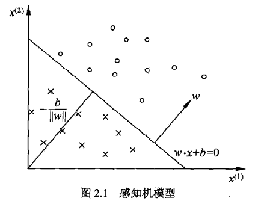

感知机，是二分类的线性分类模型。输入为实例的特征向量，输出为±1，旨在求出将训练数据进行线性划分的分离超平面，是神经网络与SVM的基础。

<!--more-->

## 2.1 感知机模型

### 定义

$$
f(x) = sign(w·x + b) \\
{\cal X} \subset R^n, \quad {\cal Y} = \{-1, +1\}
$$

其中w和b为感知机模型参数，w称为权值（向量），b称为偏置（bias）。
$$
sign(x) = \begin{cases} +1, \quad x\geq 0 \\ -1, \quad x < 0\end{cases}
$$

### 几何解释

线性方程
$$
w·x + b = 0
$$
对应于特征空间中的一个超平面S，w表示超平面的法向量，b为超平面的截距。



## 2.2 感知机学习策略

### 数据集的线性可分性

给定一个数据集，如果存在超平面S，能够将数据集的正实例点和负实例点完全正确划分，则称数据及为线性可分数据集。

#### 损失函数

损失函数的一个自然选择是误分类点的总数，但这样不是参数的连续可导函数，不易优化。

感知机选择的损失函数是误分类点到超平面S的总距离，输入空间任一点到超平面S的距离为
$$
\frac 1 {\|w\|} |w·x_0+b|,其中\|w\|为w的L_2范数
$$
对于误分类的数据来说，始终有
$$
-y_i(w·x_i+b) > 0
$$
所以距离为
$$
- \frac 1 {\|w\|}y_i(w·x_i+b)
$$
假设误分类点集合为M，求和即得
$$
- \frac 1 {\|w\|}\sum _{x_i\in M}y_i(w·x_i+b)
$$
不考虑系数，损失函数即为
$$
L(w, b) = - \sum _{x_i\in M}y_i(w·x_i+b)
$$
误分类点越少，损失函数值越小，如果没有误分类点，损失函数值为0。

## 2.3 感知机学习算法

### 形式化

给定训练集
$$
T = \{(x_1, y_1), (x_2, y_2), ... , (x_N, y_N)\} \\
x_i\in {\cal X} = R^n, y_i \in {\cal Y} = \{-1, +1\}
$$
求参数w和b，使得损失函数极小化
$$
\min_{w,b} L(w,b) = - \sum _{x_i\in M}y_i(w·x_i+b)
$$
学习算法是误分类驱动的，具体采用随机梯度下降法，首先任意选取一个超平面，之后用梯度下降法不断极小化目标函数。

损失函数的梯度为
$$
\nabla_w L(w,b) = -\sum _{x_i\in M} y_ix_i \\
\nabla_b L(w,b) = -\sum _{x_i\in M} y_i
$$
随机选取一个误分类点，对参数进行更新
$$
w \leftarrow w + \eta y_ix_i \\
b \leftarrow b + \eta y_i \\
\eta \in (0, 1]
$$

### 原始形式

1. 选取参数初值$$w_0,b_0$$

2. 在训练集中选取数据$$(x_i, y_i)$$

3. 如果$$y_i(wx_i+b)\leq 0$$，则更新参数
   $$
   w \leftarrow w + \eta y_ix_i \\
   b \leftarrow b + \eta y_i
   $$

4. 转至2直至没有误分类点

### 收敛性

(**Novikoff**) 存在满足条件的超平面，且感知机算法的误分类次数k满足不等式
$$
k \leq (\frac R \gamma)^2
$$

### 对偶形式

基本想法是，将w和b表示为实例x与标记y的线性组合，通过求解系数求得w和b。

最后学习到的w和b可表示为
$$
w = \sum _{i=1} ^N \alpha_iy_ix_i \\
b = \sum _{i=1} ^N \alpha_iy_i
$$
训练过程

1. 选取α和b为0,

2. 在训练集中选取数据

3. 若$$y_i(\sum _{j=1} ^N \alpha_jy_jx_j\cdot x_i+b)\leq 0$$，则更新参数

$$
\alpha_i \leftarrow \alpha_i + \eta \\
b \leftarrow b + \eta y_i
$$

4. 转至2直至没有误分类数据

> Gram矩阵？

## Scikit-learn

```python
from sklearn.linear_model import Perceptron

clf = Perceptron(fit_intercept=True, 
                 max_iter=1000, 
                 shuffle=True)
clf.fit(X, y)

# Weights assigned to the features.
print(clf.coef_)

# Constants in decision function.
print(clf.intercept_)

y_ = -(clf.coef_[0][0]*x_ponits + clf.intercept_)/clf.coef_[0][1]
plt.plot(x_ponits, y_)
plt.plot(x_ponits, y_)
```

