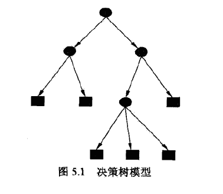
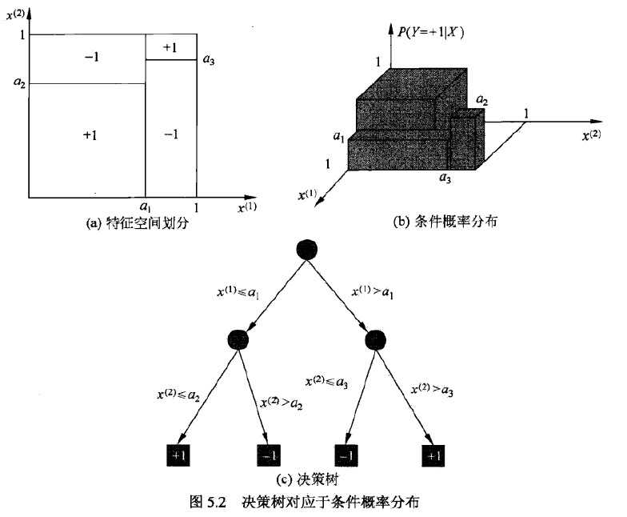
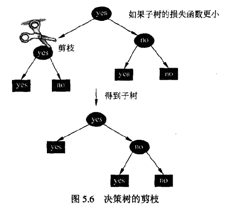

决策树是一种基本的分类与回归方法，在分类问题中，用树形结构表示基于特征对实例进行分类的过程。

<!--more-->

## 5.1 决策树模型与学习

### 定义

决策树是一种描述对实例进行分类的树形结构，由节点和有向边组成。

节点有两种类型：内部节点和叶子节点，内部节点表示特征或属性，叶子结点表示一个类。

决策树分类时，从根节点开始，对实例的某一特征进行测试，根据测试结果将其分配到子节点。如此递归，直至到达叶节点，最后分到叶节点的类中。



### 决策树学习

可以把决策树看成if-then规则的集合，每个实例只被一条路径或一条规则所覆盖。

也可以从条件概率分布的角度理解，定义在特征空间的划分上，将特征空间分为互不相交的单元或区域，在每个单元上定义一个类的概率分布就构成了一个条件概率分布。



决策树学习在本质上，是从训练集中归纳出一组分类规则，我们需要的是一个与训练集矛盾较小的决策树，同时具有很好的泛化能力。

决策树的损失函数通常是正则化的极大似然函数，学习策略是最小化损失函数。

## 5.2 特征选择

特征选择，是决定用哪个特征来划分特征空间。

### 信息增益

首先给出熵与条件熵的定义
$$
H(X)=-\sum_{i=1}^np_i\log p_i \\
0 \leq H(p) \leq \log n
$$
熵越大，随机变量的不确定性就越大。
$$
H(Y|X) = \sum_{i=1}^nP(X=x_i)H(Y|X=x_i)
$$
当熵和条件熵中的概率由数据估计得到时，称为经验熵与经验条件熵。

信息增益，定义为集合D的经验熵与特征A给定条件D下的经验条件熵之差
$$
g(D,A) = H(D) - H(D|A)
$$

> 一般，熵与条件熵之差称为互信息，信息增益等价于训练集中类与特征的互信息。

对于训练数据集D，计算每个特征的信息增益，比较大小，选择信息增益最大的特征。

### 信息增益比

$$
g_k(D,A) = \frac {g(D,A)} {H(D)}
$$

## 5.3 决策树的生成

### ID3算法

ID3算法，核心是在决策树每个节点上应用信息增益准则选择特征，递归地构建决策树。

输入：训练数据集D，特征集A，阈值ε

输出：决策树T

- 若D中所有实例属于同一类$C_k$，则T为单节点树，返回T；

- 若A为空集，则返回T；

- 否则，计算A中各特征对D的信息增益，选择信息增益最大的特征$A_g$；

- 若$A_g$的信息增益小于阈值，则返回T；

- 否则，对$A_g$的每一可能值，以此将D分割成若干非空子集，将实例树最大的类作为标记，构建子节点，由节点及其子节点构成树T，返回T；

- 对第i个子节点，以$D_i$为训练集，$A-{A_g}$为特征集，递归调用上述步骤，得到子树$T_i$，返回$T_i$。

ID3算法只有树的生成，容易产生过拟合。

### C4.5算法

改进处在于，用信息增益比来选择特征。

## 5.4 决策树的剪枝

剪枝是为了解决过拟合现象，对已生成的决策树进行简化。

剪枝往往通过极小化损失函数或代价函数来实现。

设树T的叶子结点个数为|T|，t为T的叶子结点，t有$N_t$个样本点，其中k类的样本点有$N_{tk}$个，$H_t(T)$为t的经验熵，则损失函数可以定义为
$$
C_\alpha(T) = \sum_{t=1}^{|T|}N_tH_t(T)+\alpha|T| \\
H_t(T) = -\sum_k\frac{N_{tk}}{N_t}\log\frac{N_{tk}}{N_t}
$$
记
$$
C(T) = \sum_{t=1}^{|T|}N_tH_t(T) = -\sum_{t=1}^{|T|}\sum_{k=1}^KN_{tk}\log\frac{N_{tk}}{N_t}
$$
则有
$$
C_\alpha(T) = C(T) + \alpha|T|
$$
剪枝算法

输入：生成算法产生的整个树T，参数α

输出：修剪后的子树$T_\alpha$$

- 计算每个节点的经验熵
- 递归地从树的叶子结点向上回溯
  - 设叶节点回溯到父节点之前与之后的树分别为$T_B$与$T_A$，如果$C_\alpha(T_A)\leq C_\alpha(T_B)$，则进行剪枝，将父节点变为新的叶子结点。
- 直至不能继续为止，得到损失函数最小的子树



## 5.5 CART算法

CART同样由特征选择、树的生成及剪枝组成，既可以用于分类也可以用于回归。

### CART生成

#### 回归树

X与Y为输入和输出变量，Y是连续变量，给定训练集
$$
D = \{(x_1,y_1),(x_2,y_2),...,(x_N,y_N)\}
$$
假设已将输入空间划分为M个单元$R_1,R_2,...,R_M$，并且在每个单元$R_m$上有一个固定的输出值$c_m$，那么回归树模型可表示为
$$
f(x) = \sum_{m=1}^Mc_mI(x\in R_m)
$$
当输入空间的划分确定时，可以用平方误差来表示回归树的预测误差
$$
\sum_{x_i\in R_m}(y_i-f(x_i))^2 \\
\hat c_m = {\rm ave} (y_i|x_i\in R_m)
$$
采用启发式的方法对输入空间进行划分，选择第j个变量$x^{(j)}$和取值s，作为切分变量和切分点，并定义两个区域：
$$
R_1(j,s) = \{x|x^{(j)}\leq s\} \quad R_2(j,s) = \{x|x^{(j)}> s\}
$$
由此找到最优切分点s
$$
\hat c_1 = {\rm ave} (y_i|x_i\in R_1(j,s)) \quad \hat c_2 = {\rm ave} (y_i|x_i\in R_2(j,s))
$$
遍历所有变量，找到最优的切分变量j，以此划分输入空间，然后对每个区域重复上述过程，知道满足条件，由此生成一棵回归树，通常称为最小二乘回归树。

#### 分类树

分类树用基尼指数选择最优特征，同时决定该特征的最优二值切分点。

分类问题中，假如有K个类，样本点属于第k类的概率为$p_k$，则基尼指数定义为
$$
Gini(p) = \sum_{k=1}^Kp_k(1-p_k) = 1 - \sum_{k=1}^Kp_k^2
$$
K=2时
$$
Gini(p) = 2p(1-p)
$$
如果样本集合D根据特征A是否取可能值进行分割，即
$$
D_1 = \{(x,y)\in D|A(x)=a\}, \quad D_2 = D - D_1
$$
在特征A的条件下，基尼指数定义为
$$
Gini(D,A) = \frac {|D_1|} {D} Gini(D_1)+\frac {|D_2|} {D} Gini(D_2)
$$
基尼指数表示集合D的不确定性，基尼指数越大，样本集合的不确定性越大。

在分类树中，选择基尼指数最小的特征作为最优特征。

### CART剪枝

输入：CART生成的决策树$T_0$$

输出：最优决策树$T_\alpha$$

- 设$k=0，T=T_0$$

- 设$\alpha=+\infty$$

- 自下而上地对各内部节点计算$C(T_t)，|T_t|$以及
  $$
  g(t) = \frac {C(t) - C(T_t)} {|T_t|-1}
  $$

  $$
  \alpha = min(\alpha, g(t))
  $$

- 自上而下地访问内部节点，如果$g(t) = \alpha$，进行剪枝，并以多数表决法决定其类，得到T

- 设$k=k+1，\alpha_k=\alpha，T_k=T$$

- 如果T不是由根节点单独构成的树，回到第四步

- 采用交叉验证法，在子树序列中选取最优子树

## Scikit-learn

```python
from sklearn.tree import DecisionTreeClassifier
from sklearn.tree import export_graphviz
import graphviz

clf = DecisionTreeClassifier()
clf.fit(X_train, y_train,)

clf.score(X_test, y_test)

tree_pic = export_graphviz(clf, out_file="mytree.pdf")
with open('mytree.pdf') as f:
    dot_graph = f.read()

graphviz.Source(dot_graph)
```


## 总结

总体思路就是构造决策树，根据损失函数进行剪枝，具体细节没怎么看懂，回头找份代码瞧瞧。