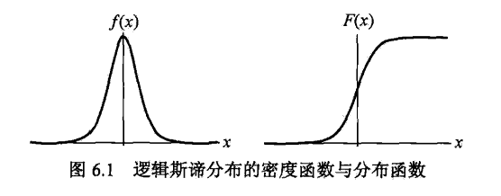

Logistic回归是统计学习中的分类方法，最大熵是概率模型学习的一个准则，推广到分类问题得到最大熵模型。

<!--more-->

## 6.1 Logistic回归模型

### Logistic分布

设X为连续随机变量，X服从Logistic分布是指
$$
F(x) = P(X\leq x) = \frac 1 {1+e^{-(x-\mu)/\gamma}} \\
f(x) = F'(x) = \frac {e^{-(x-\mu)/\gamma}} {\gamma(1+e^{-(x-\mu)/\gamma})^2}
$$
其中$$\mu$$为位置参数，$$\gamma > 0$$为形状参数

分布函数的图形是S形曲线，关于点$$(\mu, \frac 1 2)$$中心对称
$$
F(\mu-x) + F(x-\mu) = 1
$$


### 二项Logistic回归模型

二项Logistic回归模型是一种分类模型，由条件概率$$P(Y|X)$$表示，其中随机变量Y取值为1或0，条件概率分布如下：
$$
P(Y=1|x) = \frac {\exp(w\cdot x+b)} {1 + \exp(w\cdot x+b)} \\
P(Y=0|x) = \frac {1} {1 + \exp(w\cdot x+b)}
$$
w称为权值向量，b称为偏置。

有时为了方便，用如下记法
$$
P(Y=1|x) = \frac {\exp(w\cdot x)} {1 + \exp(w\cdot x)} \\
P(Y=0|x) = \frac {1} {1 + \exp(w\cdot x)} \\
w = (w^{(1)}, w^{(2)},\cdots, w^{(n)}, b) ,\quad x = (x^{(1)}, x^{(2)}, \cdots, x^{(n)}, 1)
$$
注意到
$$
\log\frac{P(Y=1|x)}{1 - P(Y=1|x)} = w\cdot x
$$
输出Y=1的对数几率是输入x的线性函数表示的模型，即Logistic模型。

### 模型参数估计

对于给定的训练集T，可以用极大似然估计法估计模型参数。
$$
P(Y=1|x) = \pi(x),\quad P(Y=0|x) = 1-\pi(x)
$$
似然函数为
$$
\prod_{i=1}^N[\pi(x_i)]^{y_i}[1-\pi(x_i)]^{1-y_i}
$$
对数似然函数为
$$
\begin{align}
L(w) &= \sum_{i=1}^N[y_i\log\pi(x_i)+(1-y_i)log(1-\pi(x_i))] \\
&= \sum_{i=1}^N[y_i\log\frac{\pi(x_i)}{1-\pi(x_i)}+log(1-\pi(x_i))] \\
&= \sum_{i=1}^N[y_i(w\cdot x_i)-log(1+\exp(w\cdot x_i))]
\end{align}
$$
对L(w)求极大值，得到w的估计值。

这样问题就变成了以L(w)为目标函数的最优化问题，通常采用梯度下降法及拟牛顿法。

### 多项Logistic回归

上述的模型是二分类模型，可以推广为多分类模型。

假设Y的取值集合是$$\{1,2,\cdots,K\}$$，则多项Logistic模型为
$$
P(Y=k|x) = \frac {\exp(w_k\cdot x+b)} {1 + \sum_k\exp(w_k\cdot x+b)} \\
P(Y=K|x) = \frac 1 {1 + \sum_k\exp(w_k\cdot x+b)} \\
k = 1,2, \cdots, K-1
$$

## 6.2 最大熵模型

### 最大熵原理

假设离散随机变量X的概率分布是P(X)，则熵为
$$
H(P) = -\sum_xP(x)\log P(x)
$$
熵满足下列不等式
$$
0 \leq H(P) \leq \log |X|
$$
当且仅当X服从均匀分布时，熵最大。

### 模型定义

假设分类模型是条件概率分布，给定训练集T，学习的目标是用最大熵原理选择最好的分类模型。

训练集的经验分布
$$
\widetilde P(X=x, Y=y) = \frac {\nu(X=x,Y=y)}{N}\\
\widetilde P(X=x) = \frac {\nu(X=x)}{N}
$$
其中$$\nu(X=x,Y=y)$$表示样本出现的频数。

用特征函数描述输入与输出的关系
$$
f(x,y) = \begin{cases} 1, \quad x与y满足某一事实 \\ 0, \quad否则\end{cases}
$$
经验分布
$$
E_{\widetilde{P}}(f) = \sum_{x,y}\widetilde P(x,y)f(x,y) \\
E_{\widetilde{P}}(f) = \sum_{x,y}\widetilde P(x)P(y|x)f(x,y)
$$
如果模型能够获取训练集中的数据，即可认为两个期望值相等。

假设满足所有约束条件的模型集合为
$$
{\cal C} = \{P\in {\cal P}|E_P(f_i) = E_{\widetilde P}(f_i), \quad i=1,2,\cdots,n\}
$$
定义在条件概率分布P(Y|X)熵的条件熵为
$$
H(P) = -\sum_{x,y}\widetilde P(x)P(y|x)\log P(y|x)
$$
则模型集合中条件熵最大的模型称为最大熵模型。

### 模型学习

给定训练集以及特征函数，最大熵模型的学习等价于约束最优化问题
$$
\begin{align}
\min_{\cal P\in C}&& &-H(P) = \sum_{x,y}\widetilde P(x)P(y|x)\log P(y|x) \\
s.t.&& &E_P(f_i) - E_{\widetilde P}(f_i)=0,\quad i=1,2,\cdots,n \\
&& &\sum_yP(y|x) = 1 \\
\end{align}
$$
将约束最优化的原始问题转化为无约束最优化的对偶问题，通过拉格朗日乘数法求解。

引入拉格朗日乘子，定义拉格朗日函数
$$
\begin{align}
L(P,w) &= -H(P) + w_o(1-\sum_yP(y|x))+\sum_{i=1}^nw_i(E_P(f_i) - E_{\widetilde P}(f_i)) \\
&= \sum_{x,y}\widetilde P(x)P(y|x)\log P(y|x) + w_o(1-\sum_yP(y|x))
\\ &\quad +\sum_{i=1}^nw_i(\sum_{x,y}\widetilde P(x,y)f_i(x,y) - \sum_{x,y}\widetilde P(x)P(y|x)f_i(x,y))
\end{align}
$$
原始问题是
$$
\min_{\cal P\in C}\max_wL(P,w)
$$
对偶问题是
$$
\max_{w}\min_{\cal P\in C}L(P,w)
$$

具体地
$$
\begin{align}
\frac {\part L(P,w)} {\part P(y|x)} &= \sum_{x,y}\widetilde P(x)(logP(y|x)+1)-\sum_yw_0-\sum_{x,y}(\widetilde P(x)\sum_{i=1}^nw_if_i(x,y)) \\
&= \sum_{x,y}\widetilde P(x)(logP(y|x)+1-w_0-\sum_{i=1}^nw_if_i(x,y))
\end{align}
$$
令$$\frac {\part L(P,w)} {\part P(y|x)}=0$$，得到
$$
P_w(y|x) = \frac 1 {Z_w(x)}\exp(\sum_{i=1}^nw_if_i(x,y)) \\
Z_w(x) = \sum_y\exp(\sum_{i=1}^nw_if_i(x,y))
$$
$$Z_w(x)$$称为规范化因子，$$f_i(x,y)$$是特征函数，由此表示的模型$$P_w$$就是最大熵模型。

对偶函数的极大化，等价于最大熵模型的极大似然估计。

## 6.3 模型学习的最优化算法

### 改进的迭代尺度法

改进的迭代尺度法（improved iterative scaling，IIS）基本想法是，找到新的参数向量$$w+\delta$$，使得模型的对数似然函数值增大，即
$$
\begin{align}
L(w+\delta) - L(w) &= \sum_{x,y}\widetilde P(x,y)\log P_{w+\delta}(y|x) - \widetilde P(x,y)\log P_{w}(y|x) \\
&= \sum_{x,y}\widetilde P(x,y)\sum_{i=1}^n\delta_if_i(x,y) - \sum_x\widetilde P(x)\log \frac{Z_{w+\delta}(x)}{Z_w(x)} \geq 0
\end{align}
$$
利用不等式
$$
-\log\alpha\geq1-\alpha,\quad\alpha>0
$$
由此
$$
\begin{align}
L(w+\delta) - L(w) &\geq \sum_{x,y}\widetilde P(x,y)\sum_{i=1}^n\delta_if_i(x,y)+1-\sum_x\widetilde P(x)\frac{Z_{w+\delta}(x)}{Z_w(x)} \\
&= \sum_{x,y}\widetilde P(x,y)\sum_{i=1}^n\delta_if_i(x,y)+1-\sum_x\widetilde P(x)\sum_yP_w(y|x)\exp\sum_{i=1}^n\delta_if_i(x,y) \\
&= A(\delta|w)
\end{align}
$$
即$$A(\delta|w)$$是改变量的一个下界，IIS试图每次只优化其中一个变量$$\delta_i$$，而固定其他变量。

通过推算，可以得到新的（相对不紧的）下界
$$
L(w+\delta)-L(w)\geq B(\delta|w)
$$
通过对$$B(\delta|w)$$求偏导数，并令其为0，得到相应的等式，依次求解方程即可。

#### 算法

**输入**：特征函数，经验分布，模型

**输出**：最优参数值，最优模型

**步骤**：

- $$\forall i\in\{1,2,\cdots,n\},\quad w_i=0$$

- $$\forall i\in\{1,2,\cdots,n\}$$

  - $$\delta_i$$满足方程
    $$
    \sum_{x,y}\widetilde P(x)P(y|x)f_i(x,y)\exp(\delta_if^\#(x,y)) = E_{\widetilde P}(f_i)
    $$
    其中
    $$
    f^\#(x,y) = \sum_{i=1}^nf_i(x,y)
    $$

  - 更新$$w_i$$：$$w_i\leftarrow w_i+\delta_i$$

- 重复直至所有$$w_i$$都收敛

### 拟牛顿法

略。

## Scikit-learn

```python
from sklearn.linear_model import LogisticRegression

# solver: liblinear, lbfgs, newton-cg, sag
clf = LogisticRegression(max_iter=200)

clf.fit(X_train, y_train)

clf.score(X_test, y_test)

print(clf.coef_, clf.intercept_)
```

